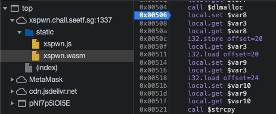
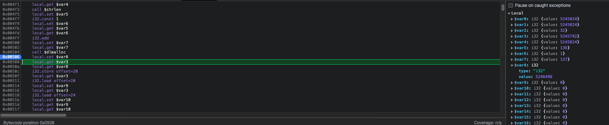

# XSPwn - Solution

**Author**: zeyu2001

**Category**: Web

1. There is a Use After Free (UAF) when deleting a node. The `HEAD` is never updated if the first index is removed.

```c
int deleteNameAtIndex(int index) {
    JARED *curr = HEAD;
    JARED *prev = NULL;
    int i = 0;
    while (curr != NULL) {
        if (i == index) {
            prev->next = curr->next;
            free(curr);
            return 0;
        }
        prev = curr;
        curr = curr->next;
        i++;
    }
    return 1;
}
```

2. Therefore, we can control `HEAD->name` by overwriting it in the next `malloc()` call in `insertSorted()`.

```c
int insertSorted(char *name) {
    
    char *newName = malloc(strlen(name) + 1);
    strcpy(newName, name);
```

3. In WASM, there is no ASLR. We can predict the address where our XSS payload is inserted - this information can be obtained by debugging with Chrome DevTools.

Notice that the `name` is written to memory, regardless of whether it passes the XSS check in `validateJared()`.

```c
char *newName = malloc(strlen(name) + 1);
strcpy(newName, name);

printf("Inserting: %s\n", newName);
if (validateJared(newName)) {
    return 1;
}
```

We could make use of this by first "inserting" our XSS payload (which will fail but write the payload to memory nonetheless), then overwriting the `HEAD->name` to the address of this XSS payload. `getNameAtIndex(0)` will then return the XSS payload when displaying the table!

For instance, if the first item we insert is our XSS payload, then the newly inserted item after the head node is deleted should have the name `\x20\x0e\x50\x00`.

We could set a breakpoint after the `malloc` call and before the `strcpy` call. Notice that `$var8` is set immediately after `call $dlmalloc` - this would be the pointer to the newly allocated memory where the payload will be stored.



In this case, after htiting the breakpoint for the 4th time (since three names are inserted before the user input is processed), we could see the pointer to our XSS payload in `$var8`: 5246496 = 0x500e20



4. Since the index here is randomized, we have a 10% chance of success:

```javascript
if (numJareds > MAX_JAREDS) {
    console.log("Too many jareds!");
    Module.ccall('deleteNameAtIndex', 'number', ['number'], [Math.floor(Math.random() * 10)]);
    numJareds--;
}
```

We could simply do this multiple times until the index is 0.
