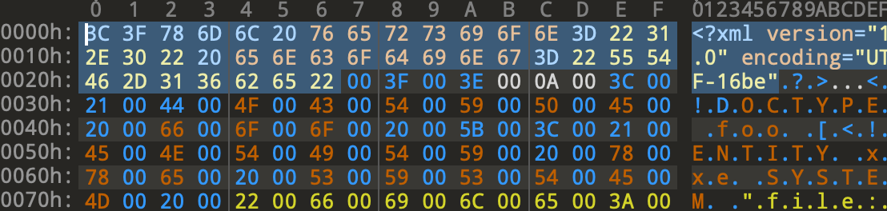

# ezXXE

**Author**: zeyu2001

**Category**: Web

Flag: `SEE{1t_w4s_n0t_th4t_hard_1_h0p3_d5e7bff2ecaca8981a5577ac04f581ff}`

## Description

Nobody:

Absolutely nobody:

Not a single soul:

Chinese CTF challenge names:

- ez____
- easy____
- baby____

## Difficulty

Medium

## Solution

First of all, where *is* the flag? We can see that it is in our session itself.

```javascript
const FLAG = process.env.FLAG || "SEE{fake_flag}"
delete process.env.FLAG

...

app.use((req, res, next) => {
    if (!req.session.flag) {
        req.session.flag = FLAG
    }
    next()
})
```

Since `FileStore` is used for session storage, our session data would be stored in local files.

```javascript
app.use(session({
    store: new FileStore(),
    secret: crypto.randomBytes(64).toString('hex'),
    resave: false,
    saveUninitialized: false,
}))
```

Our goal would thus be to exploit the XXE vulnerability to read the flag from our session file. The name of this file can be inferred from the cookie value - for example, if this is our cookie:

```
connect.sid=s:XD_gksHWWDvIk_KQDW8BNfU9elC14d8k.3gzH330M/MojLBfMqTnyQDXWeW/tofxWED9SOdDxdxg
```

then our session file is `./sessions/XD_gksHWWDvIk_KQDW8BNfU9elC14d8k.json`.

The difficult part is getting around various restrictions implemented using regex filters.

1. Bypass `validateXML`

If we look at the implementation of the blacklist below, we would quickly notice that we need to somehow bypass the regex filters if we hope to exploit the XML parser. Without the `DOCTYPE` and `ENTITY` declarations, there is no way to perform an XXE attack.

```javascript
const BLACKLIST = [
    /<!DOCTYPE/i,
    /<!ENTITY/i,
    /SYSTEM/i,
    /PUBLIC/i
]

...

const validateXML = (xml) => {
    for (const regex of BLACKLIST) {
        if (regex.test(xml)) {
            return false
        }
    }
    return /^<\?xml version="1.0"/.test(xml)
}
```

Thankfully, XML documents are very flexible and allows us to specify different encodings in the [XML declaration](https://www.w3resource.com/xml/declarations.php). It follows that we could use an encoding such as UTF-16 (that uses at least 2 bytes per character) to bypass the blacklist filters, since they do not take null bytes into account.

However, the last regex `/^<\?xml version="1.0"/` still needs to yield a match. This means that the beginning of our XML must still be in UTF-8. The library used, [libxmljs](https://www.npmjs.com/package/libxmljs), is a wrapper around the C library [libxml2](https://gitlab.gnome.org/GNOME/libxml2). A [known technique](https://mohemiv.com/all/evil-xml/) is to use two encodings, UTF-8 for the XML declaration up to the end of the `encoding` attribute, and a different encoding for the rest of the document.



2. Bypass `removePigeonsWithFlag`

This one is just another example of JavaScript being JavaScript.

```javascript
const removePigeonsWithFlag = (pigeons) => {
    const flagRegex = /SEE{\w{60}}/ig
    
    let cleanPigeons = []
    for (const pigeon of pigeons) {
        if (
            !flagRegex.test(pigeon.name) &&
            !flagRegex.test(pigeon.image) &&
            !flagRegex.test(pigeon.description) &&
            !flagRegex.test(pigeon.website)
        )
            cleanPigeons.push(pigeon)
    }
    return cleanPigeons
}
```

The effect of using the `g` (global) flag in a JavaScript regex can cause unexpected results if one is not familiar with it. Let's take a look at the `RegExp.test` [documentation](https://developer.mozilla.org/en-US/docs/Web/JavaScript/Reference/Global_Objects/RegExp/test).

> When a regex has the global flag set, test() will advance the lastIndex of the regex. (RegExp.prototype.exec() also advances the lastIndex property.)

> Further calls to test(str) will resume searching str starting from lastIndex. The lastIndex property will continue to increase each time test() returns true.

All this is to say that if we have multiple `pigeon` nodes, we can advance the `lastIndex` by purposely causing matches of `SEE{ ... }` until the `lastIndex` is large enough to fail to match on the `pigeon` node with the *actual* flag.

```xml
<pigeon>
    <name>SEE{aaa...aaa}</name>
    ...
</pigeon>

...

<pigeon>
    <name>SEE{aaa...aaa}SEE{aaa...aaa}SEE{aaa...aaa}SEE{aaa...aaa}</name>
    ...
</pigeon>
<pigeon>
    <name>&xxe;</name>  <!-- flag is here -->
    ...
</pigeon>
```

By the time we reach the last node, the `lastIndex` would be larger than the index of the flag in the session file, allowing the check to pass successfully.

The full script to generate the exploit XML is in [`solve/gen.py`](./solve/gen.py).